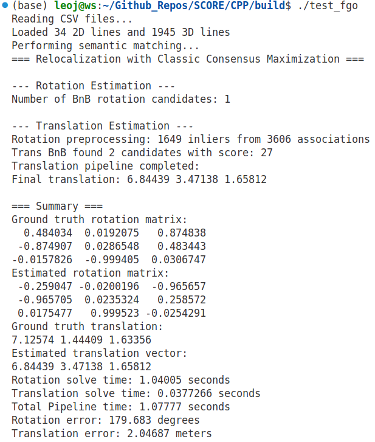

### Notice
- RotFGO implements accelerated rotation BnB. The interface of saturation function is a private member of class RotFGO:
``` C++
   pF_Buffer_Gen pF_buffer
```
   - where pF_Buffer is a function pointer as declared in helper.h
``` C++
   using pF_Buffer_Gen = std::function<Eigen::MatrixXd(const std::vector<int>&)>;
```
   - Call member function setSatBufferFunc to set saturation function.
- TransFGO implements accelerated translation BnB, and pruning and tuning procedures. The interface of saturation function is similar to that of RotFGO. 
- We provide in help.h three saturation functions:
``` C++
// Function to create classic consensus maximization buffer
Eigen::MatrixXd createCMBuffer(const std::vector<int> &ids);
// Function to create truncated saturation function buffer
Eigen::MatrixXd createTRBuffer(const std::vector<int> &ids);
// Function to create maximum likelihood saturation function buffer
Eigen::MatrixXd createMLBuffer(const std::vector<int> &ids, double q_value, double epsilon, double u);
```

### 0. install dependency
Eigen3 and OpenMP

### 1. compile
- First revise datafolder path in test.cpp and reloc_one.cpp.
- Set(CMAKE_BUILD_TYPE "Debug") in CMakeLists.txt if when debugging. (**optional**)
``` bash
mkdir build && cd build && cmake .. && make
```

### 2. run test.cpp which uses data under csv_dataset/test_data
- The program should output similar results as matlab test code matlab/test.m:
<p align="center">
    
    
</p>

### 3. Download csv datasets and run reloc_one.cpp to relocalize a chosen query image
- Usage example: build/reloc_one 1 y 2 4, which means 
   - (1/2/3/4):    choose scene S1/S2/S3/S4
   - (y/n):use ground truth labels or predicted lables, 
   - (0/1/2/3...): 0 for search rotation axis on the whole sphere, n>=1 for search on a subcube with side length pi/n
   - (1/2/3/4...): image idx in query image lists. 


