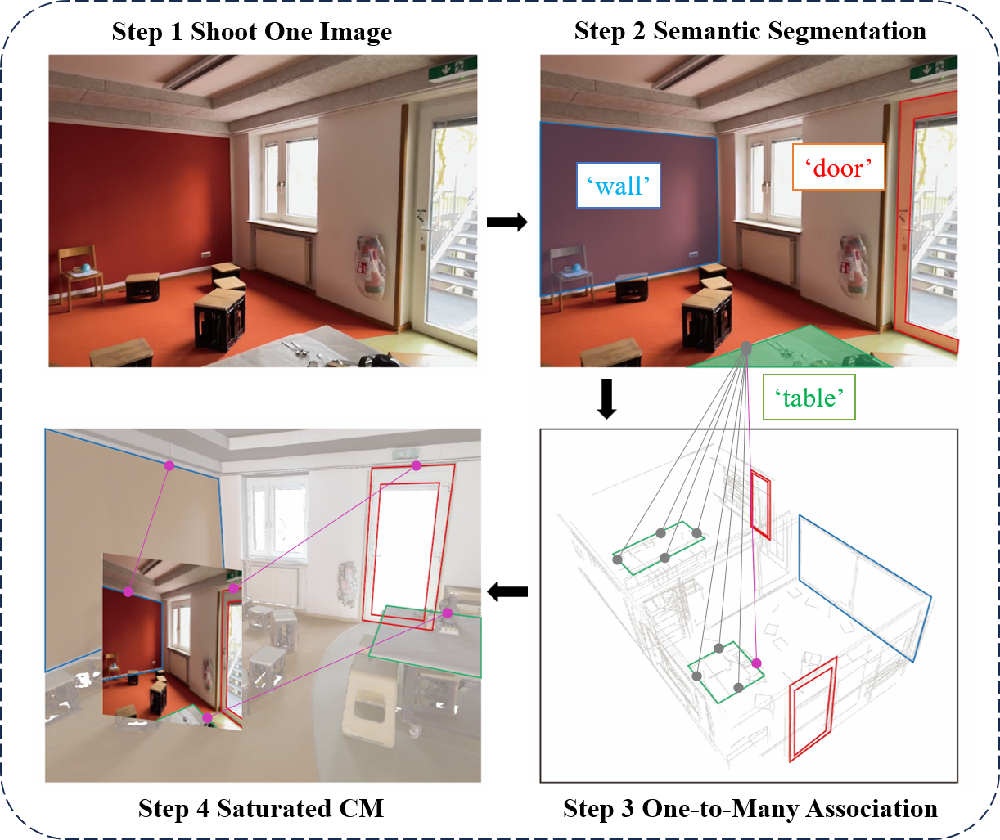

## SCORE: Saturated Consensus Relocalization in Semantic Line Maps
Our paper has been accepted by IROS 2025, and a longer version can be found on arxiv: 
https://arxiv.org/pdf/2503.03254
<p align="center">
    
</p>

### 1. Test our matlab and CPP implementation
- The test codes use data under csv_dataset/test_data, available after git clone.
- matlab/test.m  (check first your platform can use our compiled mex functions).
- CPP/test.cpp   (compile first, require Eigen3 and OpenMP).
``` bash
cd CPP && mkdir build && cd build && cmake .. && make
```

### 2. Download our datasets
including
- preprocessed csv datasets (CSV_dataset.tar.gz)
- semantic segmentation masks (*_segmentation_mask.tar.gz).

Google drive link: https://drive.google.com/drive/folders/141lQdHufOMp3ovRSQsV_06HDgxwhTKuF?usp=sharing


### 3. Replicate experiment results presented in our paper:
- Extract CSV_dataset.tar.gz downloaded from Google drive and move files (S1 S1_pred ...) into folder csv_dataset.
- Choose any query image and relocalize it with CPP/reloc_one.cpp.
- Run matlab/Experiments/rotation.m, pipeline.m, and sensitivity_plot.m in sequence.
- The matlab codes take time, we recommend a fast trial in scene S2 office and use gt semantic labels.
- **Refer to README files** under corresponding folders for more details.

#### Disclaimer
Since the publication of the paper, we have been continuously improving the codebase. As a consequence, the results might
slightly deviate from (usually improve over) the original numbers found in our IROS2025 paper.

### 4. Go through line map construction pipeline on ScanNet++ Dataset
#### Download ScanNet++ Dataset
We revised the pre-processing code for ScanNet++. Follow README.md under folder scannetpp.

### Semantic Segmentation Pipeline combing RAM++ and Grounded-SAM
Follow README.md under folder semantic_pipeline.

#### Extract 3D Semantic Line Maps
Follow README.md under folder line_map_extractor.

### Citation
If you find our work helpful, please cite:
```
@article{jiang2025score,
  title={SCORE: Saturated Consensus Relocalization in Semantic Line Maps},
  author={Jiang, Haodong and Zheng, Xiang and Zhang, Yanglin and Zeng, Qingcheng and Li, Yiqian and Hong, Ziyang and Wu, Junfeng},
  journal={arXiv preprint arXiv:2503.03254},
  year={2025}
}
```
