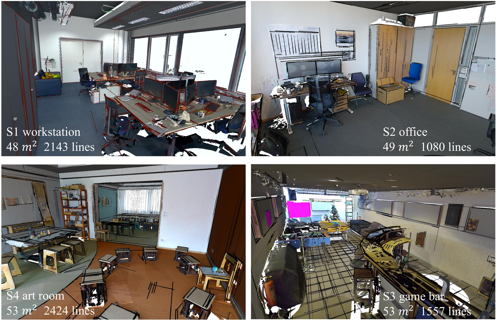

<p align="center">
    
</p>

### Notice: 
- In the paper we use S1-S4 to denote scenes, under this folder we use scene ids given by ScanNet++:

    **a1d9da703c**: S1 work station, **689fec23d7**: S2 office, **c173f62b15**: S3 game bar, **69e5939669**: S4 art room

- The hyper-parameters with default values are in helper.py.
- The retriveal results using NetVLAD are under folder line_map_extractor/NetVLAD20/*. 
  - In experiment, we choose the first 12 retrived images. You can tune this number in prepare_query_data.py.
- You can tune scene dictionaries by revising id_remapping.txt files under folder dictionary.

### 0. Install the dependencies
```bash
pip install -r line_map_extractor/requirements.txt
```

### 1. Partition reference and query images:
- Remember to revise variables data_root_dir, output_root_dir, and scene_list.
``` bash
python line_map_extractor/partition_ref_query.py
``` 

### 2. Regress 3D lines from each reference image:
- Extract 2D lines in the images, and assign a semantic label for each line according to the semantic mask.
- Regress the corresponding 3D line based on pose and depth, assign the 3D line with the same label as the 2D line.
- Remember to revise variables data_root_dir and output_root_dir in the code
``` bash
python line_map_extractor/construct_raw_line_map.py
```
- This code outputs *_results_raw.npy and *_raw_3D_line_mesh.ply under folders line_map_extractor/out/\*/map. 
- Reference images annotated with extracted lines and semantics are output under folders line_map_extractor/out/\*/map/rgb_line_image
  - red 2D lines on the image encouter the background inference issue during regression, which is detailed in our paper.


### 3. Cluster the regressed 3D lines for a neat map:
``` bash 
python line_map_extractor/merge_prune_line_map.py
# or Use previously contructed consistency graph
python line_map_extractor/merge_prune_line_map.py -r y 
```
- This code outputs *_results_merged.npy, *_edges.npy, and *_merged_3D_line_mesh.ply under folders line_map_extractor/out/\*/map. 
- This code also output 3D line map in the sfm form under folders line_map_extractor/out/\*/map/sfm. 

### 4. Extract 2D lines and semantics from query images:
``` bash
python line_map_extractor/prepare_query_data.py
```
- This code outputs *_query_data.npy under folders line_map_extractor/out/\*/query.
- Query images annotated with extracted lines and semantics are under folders line_map_extractor/out/\*/query/rgb_line_image

### 5. Utilize and evaluate semantic segmentation results 
- Run line_map_extractor/evaluate_prediction.ipynb
- Remember to set variables project_root_dir and mask_folder.
- You can download the segmentation results from our Google drive link.

### 6. Output csv files based on the stored numpy files
``` bash
python csv_dataset/output_csv_files.py
```
- Remeber to set variable project_dir.
