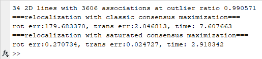

## FGO_PnL/* contains all the code for our accelerated PnL solver
1. We have compiled time-consuming bounding functions into mex files, you can find them under FGO_PnL/mexfunctions.
   If the provided mex files cannot work on your platform, 
   - either set variables 'mex_flag=0' in functions Sat_RotFGO and Sat_TransFGO; (**codes run at a slower speed**)
   - or compile the mex functions by yourself based on MATLAB documentation and entry points we provide (entry_*.m ).

2. Choose your saturation function with matrix input 'sat_buff' for functions Sat_RotFGO.m, Sat_TransFGO.m
   For classic consensus maximization, set 'sat_buff' as an all-one matrix.

3. The whole estimation pipeline goes as follows: (refer to Experiments/pipeline.m)
   - Confine the 3D line map according to image retriveal(IR) result  **(optional)**  
   - Confine the search space of rotation axis according to IR result (FGO_PnL/helpers/confine_sphere) **(optional)**
   - Match 2D image line and 3D map lines according to semantic labels. (Experiments/utils/match_line)
   - Design your saturation function for rot estimation and store weights in a matrix.
   - Accelerated rotation BnB solver. (FGO_PnL/Rotation/Sat_RotFGO)
   - Run the following procedure for each rot candidate returned by rot BnB.
   - Find inliers under rotation, and perturb 2D line normal vectors (FGO_PnL/Translation/pert_n.m).
   - Design your saturation function for rot estimation and store weights in a matrix.
   - Accelerated translation BnB solver (FGO_PnL/Translation/Sat_TransFGO.m).
   - Prune translation candidates using geometric constraints (FGO_PnL/Translation/prune_inliers.m).
   - Fine-tune translation candidates by minimizing least squares error (FGO_PnL/Translation/tune_t.m).
    
   
## Experiments/* contains all the experiment code
1. run test.m 
   - The used csv files are available under csv_dataset/test_data.
   - output under default parameters:

    

2. run Experiments/rotation.m 
   - The used csv files need to be downloaded from Google drive and put under csv_dataset/.
   - Configure experiments by setting the following variables:

      scene_idx: 1,2,3,4  (scene S1 S2 S3 S4)

      pred_flag = 0,1     (predicted semantic label or gt label)

      two_or_eight = 0;   (side length of the search space for rotation axis equals pi or pi/2)

3. run Experiments/pipeline.m
   - Configure experiments by setting the same variables as rotation.m
   - Rotation estimation results under the same setting need to be obtained first by running rotation.m

4. run Experiments/sensitivity_plot.m
   - This code plots recall curves of rotation and translation error under different choices of parameter q.